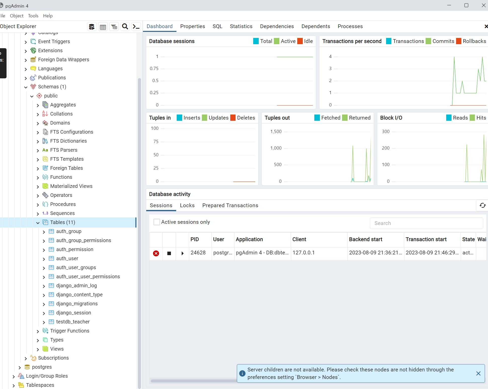

Sucessfully migrate django data to postgres.

models.py from testdb app, which indicate as testdb_teacher.

note: did not submit any data into the table of it since the purpose of this test was to see whether connection can be implemented on django.

reference:

https://docs.djangoproject.com/en/4.2/ref/databases/#postgresql-notes
https://docs.djangoproject.com/en/4.2/ref/settings/#std-setting-DATABASES
